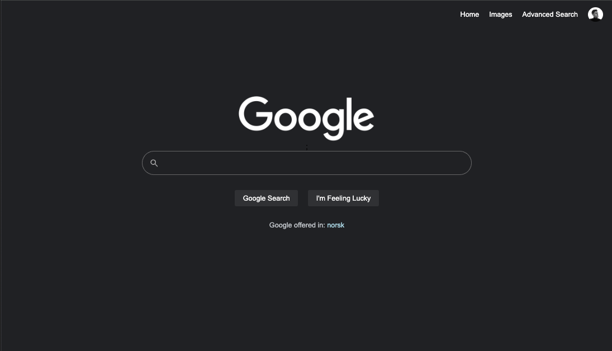

# CS50search
Project 0 in the HarvardX CS50W course.

Link to page:
https://haraldeskeland.github.io/Google-Search-Clone---CS50/

<strong>Description:</strong>
The task was to recreate the google search engine using HTML and CSS, and having the functionality from the classic Google Search, Google Images and Advanced Search.

<strong><i>Navigate using the navigation bar in the top right corner.</i></strong>

<strong>Main page: </strong>
Regular Google Search
The 'I'm Feeling Lucky' button takes you to the first search result available.

<strong>Images:</strong>
Regular Google Images search.

<strong>Advanced Search:</strong>
Lets you specify what has to be included or excluded in your search for more specificity. 

